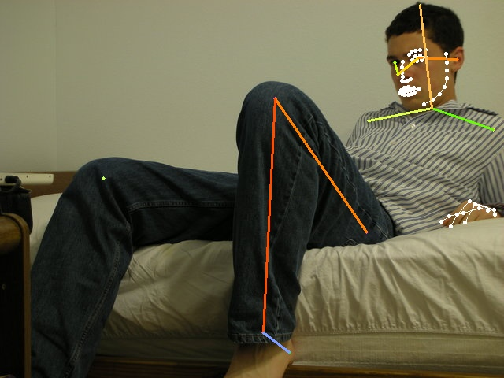
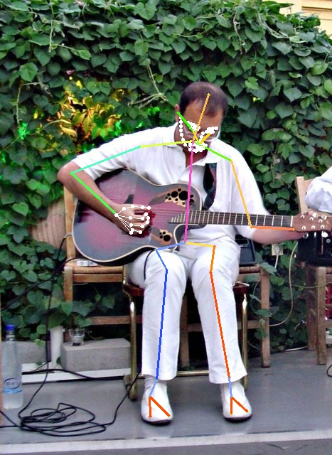
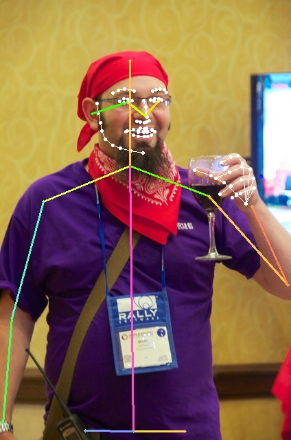
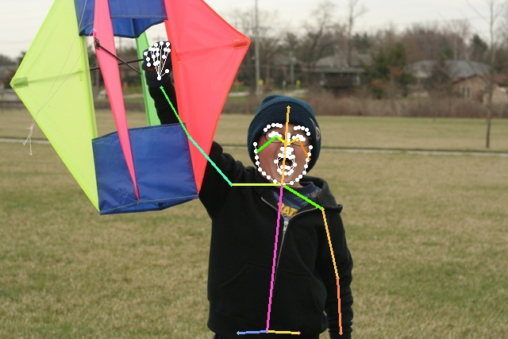
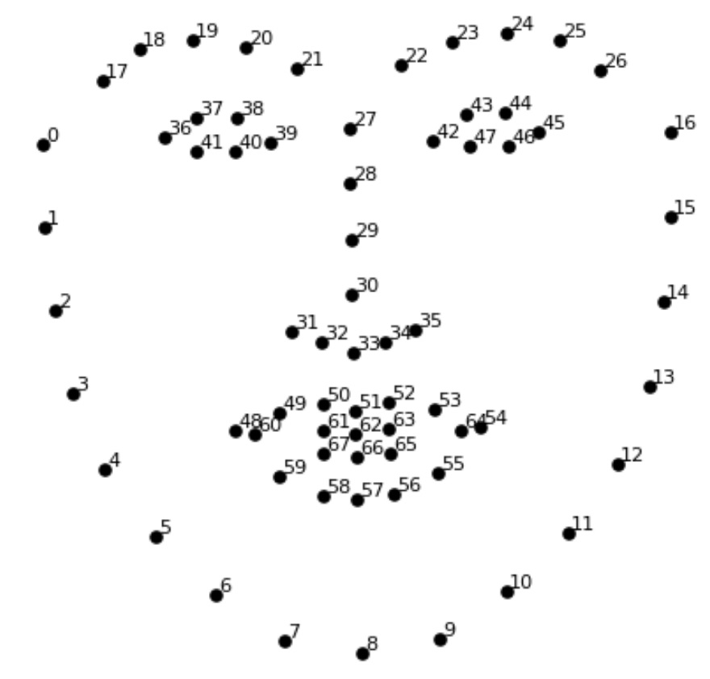
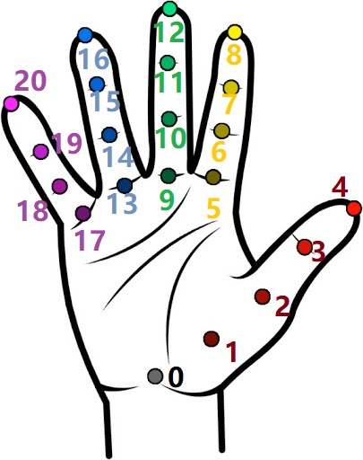

# Halpe Full-Body Human Keypoints and HOI-Det dataset

## What is Halpe?
**Halpe** is a dataset introduced in [**AlphaPose paper**](http://arxiv.org/abs/2211.03375).  It aims at pushing <b>Human Understanding</b> to the extreme. We provide detailed annotation of human keypoints, together with the human-object interaction trplets from HICO-DET. For each person, we annotate 136 keypoints in total, including head,face,body,hand and foot. Below we provide some samples of Halpe dataset.
<div align="center">
    
    
    
    
    
</div>

## Download
Train annotations [[Baidu](https://pan.baidu.com/s/1hWX-I-HpXXnLcprFskfriQ) | [Google](https://drive.google.com/file/d/13vj8H0GZ9yugLPhVVWV9fcH-3RyW5Wk5/view?usp=sharing) ]

Val annotations [[Baidu](https://pan.baidu.com/s/1yDvBkXTSwk20EjiYzimpPw) | [Google](https://drive.google.com/file/d/1FdyCgro2t9_nOhTlMPjEf3c0aLOz9wi6/view?usp=sharing) ]

Train images from [HICO-DET](https://drive.google.com/open?id=1QZcJmGVlF9f4h-XLWe9Gkmnmj2z1gSnk)

Val images from [COCO](http://images.cocodataset.org/zips/val2017.zip)

## Realtime Demo with tracking
Trained model is available in [AlphaPose](https://github.com/MVIG-SJTU/AlphaPose)! 
Check out its [MODEL_ZOO](https://github.com/MVIG-SJTU/AlphaPose/blob/master/docs/MODEL_ZOO.md)
<div align="center">
    
</div>


## Keypoints format
We annotate 136 keypoints in total:
```
    //26 body keypoints
    {0,  "Nose"},
    {1,  "LEye"},
    {2,  "REye"},
    {3,  "LEar"},
    {4,  "REar"},
    {5,  "LShoulder"},
    {6,  "RShoulder"},
    {7,  "LElbow"},
    {8,  "RElbow"},
    {9,  "LWrist"},
    {10, "RWrist"},
    {11, "LHip"},
    {12, "RHip"},
    {13, "LKnee"},
    {14, "Rknee"},
    {15, "LAnkle"},
    {16, "RAnkle"},
    {17,  "Head"},
    {18,  "Neck"},
    {19,  "Hip"},
    {20, "LBigToe"},
    {21, "RBigToe"},
    {22, "LSmallToe"},
    {23, "RSmallToe"},
    {24, "LHeel"},
    {25, "RHeel"},
    //face
    {26-93, 68 Face Keypoints}
    //left hand
    {94-114, 21 Left Hand Keypoints}
    //right hand
    {115-135, 21 Right Hand Keypoints}
```
Illustration:
<div align="center">
    <br>
    26 body keypoints
</div>
<div align="center">
    <br>
    68 face keypoints
</div>
<div align="center">
    <br>
    21 hand keypoints
</div>

## Usage
The annotation is in the same format as COCO dataset. For usage, a good start is to check out the `vis.py`. We also provide related APIs. See [halpecocotools](https://github.com/HaoyiZhu/HalpeCOCOAPI), which can be installed by `pip install halpecocotools`.

## Evaluation
We adopt the same evaluation metrics as COCO dataset. 

## Related resources
A concurrent work [COCO-WholeBody](https://github.com/jin-s13/COCO-WholeBody) also annotate the full body keypoints. And HOI-DET for COCO dataset is also available at [V-COCO](https://github.com/s-gupta/v-coco)

## Citation
If the data helps your research, please cite the following paper:
```
@article{alphapose,
  author = {Fang, Hao-Shu and Li, Jiefeng and Tang, Hongyang and Xu, Chao and Zhu, Haoyi and Xiu, Yuliang and Li, Yong-Lu and Lu, Cewu},
  journal = {IEEE Transactions on Pattern Analysis and Machine Intelligence},
  title = {AlphaPose: Whole-Body Regional Multi-Person Pose Estimation and Tracking in Real-Time},
  year = {2022}
}
```
