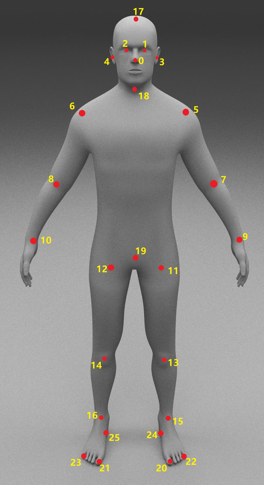

# Halpe Full-Body Human Keypoints and HOI-Det dataset

## What is Halpe?
Halpe is a joint project under [AlphaPose](https://github.com/MVIG-SJTU/AlphaPose) and [HAKE](http://hake-mvig.cn/).  It aims at pushing <b>Human Understanding</b> to the extreme. We provide detailed annotation of human keypoints, together with the human-object interaction trplets from HICO-DET. For each person, we annotate 136 keypoints in total, including head,face,body,hand and foot. Below we provide some samples of Halpe dataset.
<div align="center">
    
    
    
    
    
</div>

## Download
Train annotations [[Baidu](https://pan.baidu.com/s/1hWX-I-HpXXnLcprFskfriQ) | [Google](https://drive.google.com/file/d/13vj8H0GZ9yugLPhVVWV9fcH-3RyW5Wk5/view?usp=sharing) ]

Val annotations [[Baidu](https://pan.baidu.com/s/1yDvBkXTSwk20EjiYzimpPw) | [Google](https://drive.google.com/file/d/1FdyCgro2t9_nOhTlMPjEf3c0aLOz9wi6/view?usp=sharing) ]

Train images from [HICO-DET](https://drive.google.com/open?id=1QZcJmGVlF9f4h-XLWe9Gkmnmj2z1gSnk)

Val images from [COCO](http://images.cocodataset.org/zips/val2017.zip)


## Keypoints format
We annotate 136 keypoints in total:
```
    //26 body keypoints
    {0,  "Nose"},
    {1,  "LEye"},
    {2,  "REye"},
    {3,  "LEar"},
    {4,  "REar"},
    {5,  "LShoulder"},
    {6,  "RShoulder"},
    {7,  "LElbow"},
    {8,  "RElbow"},
    {9,  "LWrist"},
    {10, "RWrist"},
    {11, "LHip"},
    {12, "RHip"},
    {13, "LKnee"},
    {14, "Rknee"},
    {15, "LAnkle"},
    {16, "RAnkle"},
    {17,  "Head"},
    {18,  "Neck"},
    {19,  "Hip"},
    {20, "LBigToe"},
    {21, "RBigToe"},
    {22, "LSmallToe"},
    {23, "RSmallToe"},
    {24, "LHeel"},
    {25, "RHeel"},
    //face
    {26-93, 68 Face Keypoints}
    //left hand
    {94-114, 21 Left Hand Keypoints}
    //right hand
    {115-135, 21 Right Hand Keypoints}
```
Illustration:
<div align="center">
    <br>
    26 body keypoints
</div>
<div align="center">
    <br>
    68 face keypoints
</div>
<div align="center">
    <br>
    21 hand keypoints
</div>

## Usage
The annotation in the same format as COCO dataset. We also provide related APIs.

## Evaluation
We adopt the same evaluation metrics as COCO dataset. 

## Citation
The paper introducing this project is coming soon.
If the data helps your research, please cite the following papers at present:
```
@inproceedings{fang2017rmpe,
  title={{RMPE}: Regional Multi-person Pose Estimation},
  author={Fang, Hao-Shu and Xie, Shuqin and Tai, Yu-Wing and Lu, Cewu},
  booktitle={ICCV},
  year={2017}
}
@inproceedings{li2020pastanet,
  title={PaStaNet: Toward Human Activity Knowledge Engine},
  author={Li, Yong-Lu and Xu, Liang and Liu, Xinpeng and Huang, Xijie and Xu, Yue and Wang, Shiyi and Fang, Hao-Shu and Ma, Ze and Chen, Mingyang and Lu, Cewu},
  booktitle={CVPR},
  year={2020}
}
```
